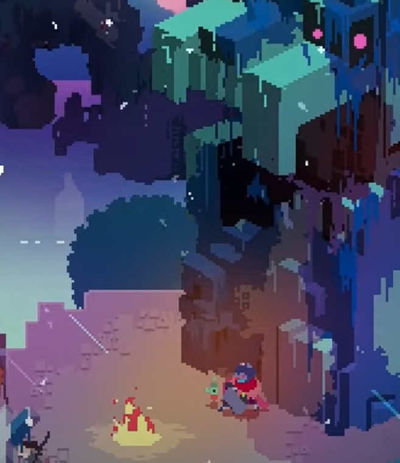
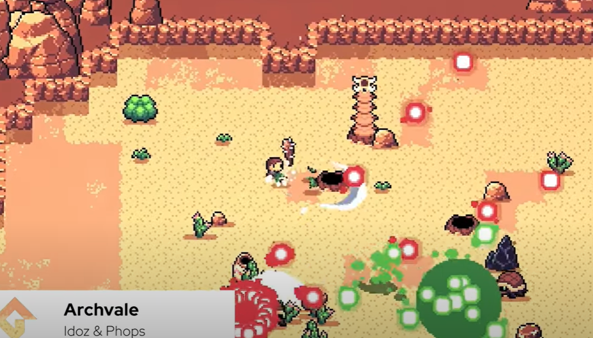
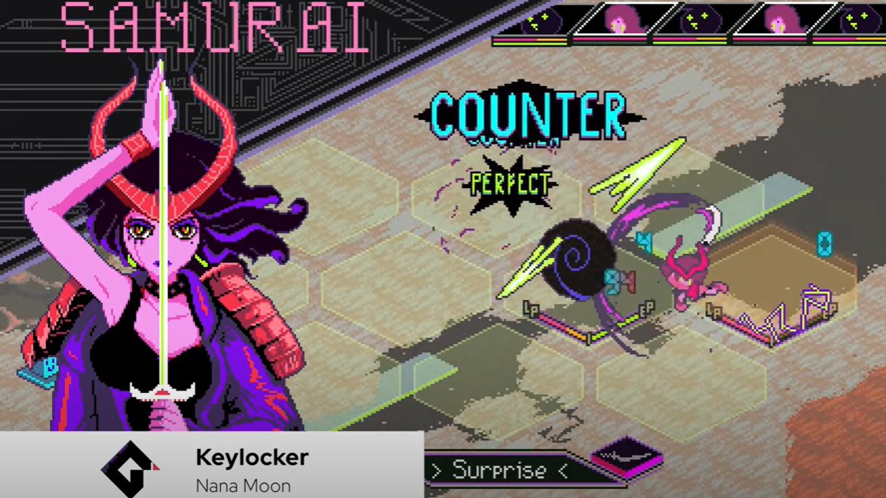
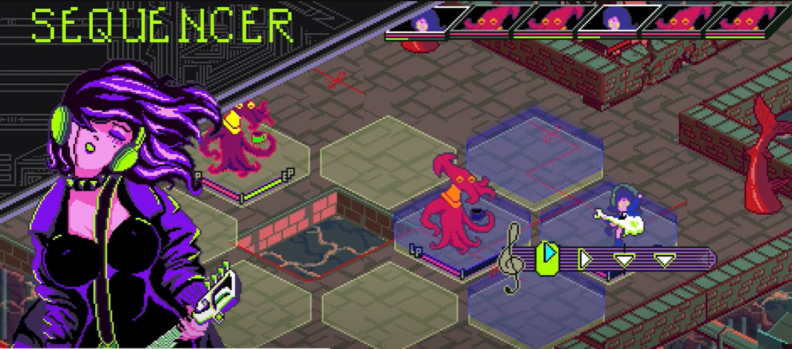
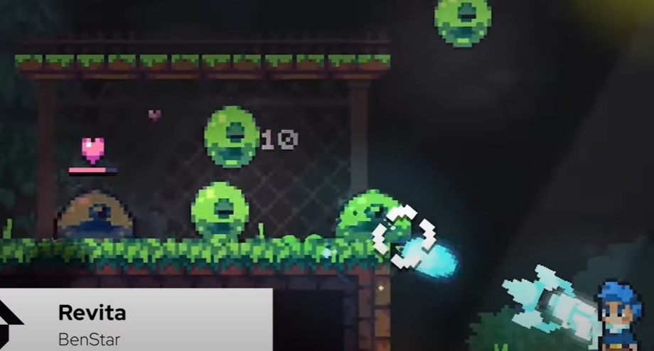
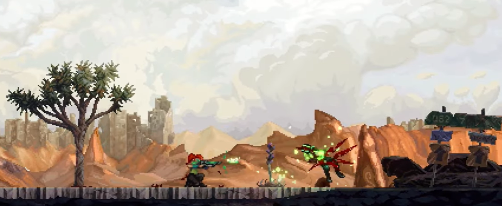
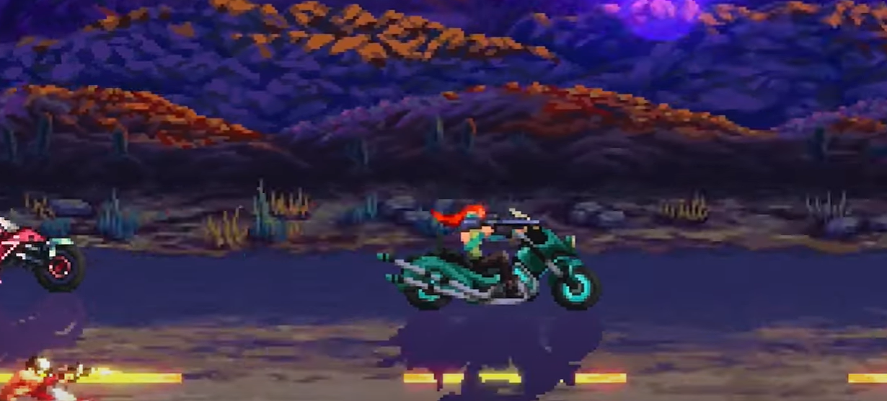
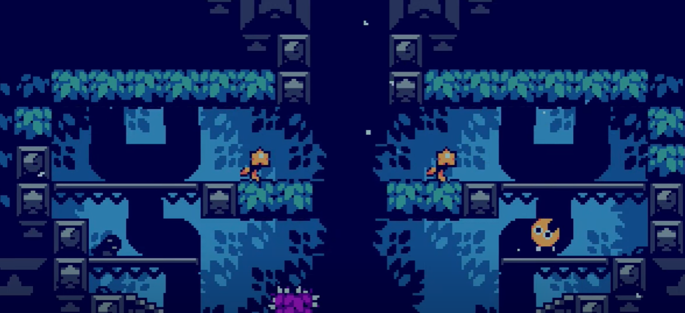
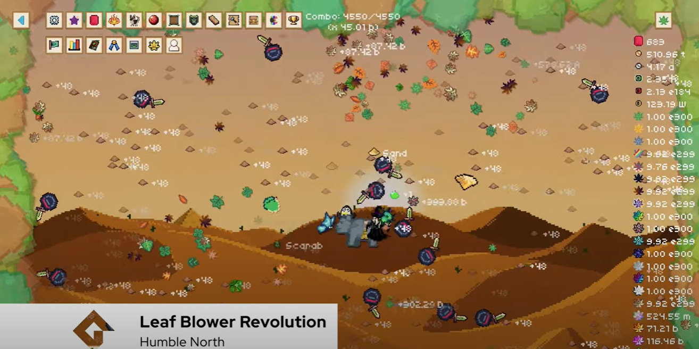
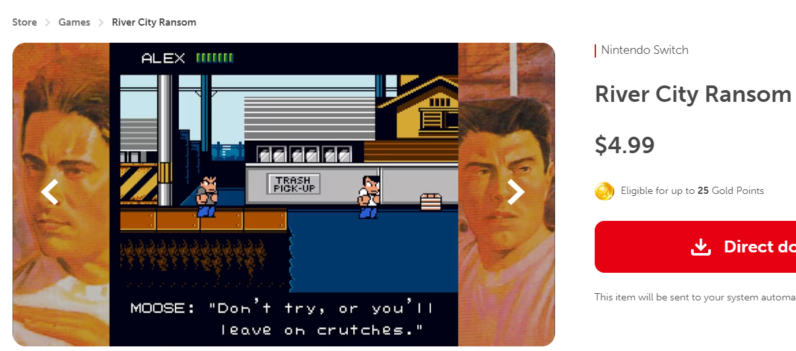

game genres: a easy way to convey the type and mechanics
A article to [show](https://gamemaker.io/en/blog/2d-game-genres)
A vidio to [show](https://www.youtube.com/watch?v=3rnE5GbklN0)
- Adventure
	- hyper light drifter
	- 我感觉我们要做这种类型的2D地图
	- 
	- 
- Visual Novel
	- Va-11 Hall-A
	- 
- Roll play game (RPG)
	-  undertale
	- 
	- engaging battle and dialogue system
- Rhythm - do it to the beat
	- Lofi Ping Pong
- Sport game
	- base on/ develop from nowadays existed game
- Action
	- Katana Zero
	- 
	- it is all about action! 
	- you need practice and die many times
- Fight game
	- Street Fighter
	- SHATTERED REALMS
- bullet hell 弹幕类
	- Touhou
	- 
- Turn Base
	- Fire Emblem
	- Keylocker
	- 
	- 
	- estimate and calculate and chack your strategy
- Multiplayer
	- 坦克动荡
	- 派对合家欢游戏
- Roguelike
	- Hades
	- Revita
	- 
	- A roguelike is a subgenre of video games characterized by procedurally **generated levels, turn-based gameplay, and permanent death of characters**. Players often delve into dungeons, collecting items and battling enemies, with the ultimate goal of reaching the deepest levels or defeating a powerful boss.
	- every time new start
	- random generated level, boss same
- metroidvania
	- 合成自任天堂旗下的《银河战士(Metroid)》和Konami旗下的《恶魔城(Castlevania)》
	- Hollow Knight
	- 
	- 
	- upgrade yourself to explore **more area**
- Plateformer
	  - Celeste
	  - moonleap
	  - gravity shifting
	  - -
  - idle game
    - Cookie Clicker
    - you can play it **while doing other things**
    - 
    - 增量游戏（Incremental game），俗称放置游戏（Idle game）[1]，又称点击游戏（Clicker game)
    - 资源收集、升级和自动化的元素。
    - 玩家可以通过偶尔的点击或策略来优化游戏进程，体验轻松和渐进式的游戏乐趣
- Beatem up game
	- 
	-  punching your way through swathes of enemies until you reach a checkpoint or get taken out yourself.

  
